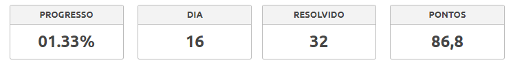
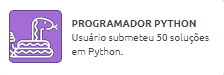
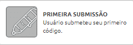
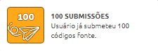
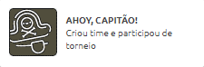
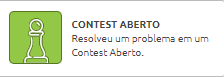
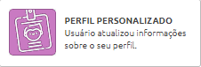
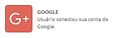
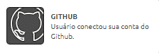
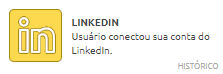

# 🐝 BeeCrowd_Desafios
💻# Aqui estão minhas soluções para os desafios do Beecrowd. Uma coleção organizada para acompanhar meu progresso na resolução de problemas de programação. Explore as soluções para diversos desafios e acompanhe minha jornada de aprendizado!

## 🙋‍♂️ Profile
**- Problemas:** [Minhas Soluções](https://www.beecrowd.com.br/judge/pt/profile/915702)  
**- Estatísticas:** [Meus Status](https://www.beecrowd.com.br/judge/pt/users/statistics/915702)  

## 🏅 Conquistas
### 💻 - Linguagem

### 🗂️ - Submissões
  

### 🏆 - Torneios
 

### 👤 - Perfil
  

